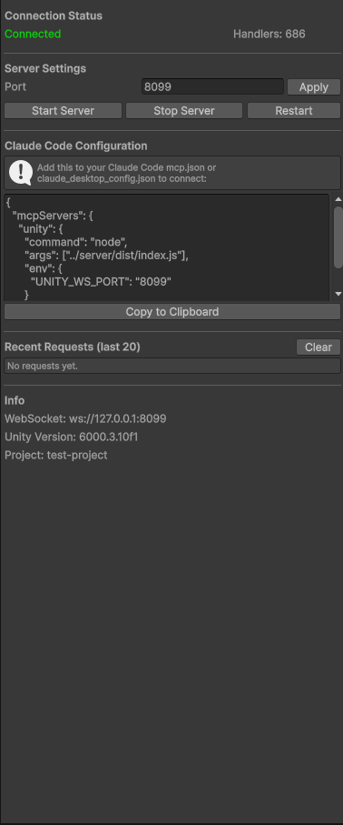

# Unity MCP — 718 Tools for AI-Powered Game Development

[](LICENSE)
[](https://unity.com)
[](https://nodejs.org)

MCP (Model Context Protocol) server that connects **Claude Code** (or any MCP client) directly to the **Unity Editor**. Control every aspect of Unity — scenes, assets, materials, physics, lighting, animation, UI, and more — through natural language.

**Free. Open-source. Full codebase access. No API key required.**

## What Can You Do?

Just talk to Claude Code in plain English (or any language):

- _"Create a first-person controller with mouse look and WASD movement"_
- _"Add a directional light, skybox fog, and bake lighting for this scene"_
- _"Generate a tile palette from these sprites and paint a 20x20 dungeon"_
- _"Capture a screenshot of the Inspector and tell me what's wrong with my Rigidbody setup"_
- _"Find all missing script references and list them"_
- _"Create a Cinemachine virtual camera that follows the player with smooth damping"_

Claude reads your scene, edits components, creates scripts, bakes lighting, runs tests, captures screenshots — all while you focus on design decisions.

## Quick Start

```bash
# In your Unity project root:
npx github:karnelian/unity-mcp setup
```

This single command:
1. Installs the Unity Editor plugin to `Assets/KarnelLabsMCP/Editor/`
2. Adds Unity's official `com.unity.nuget.newtonsoft-json` package to `Packages/manifest.json` when missing — this uses Unity Package Manager and does **not** require a separate `nuget` CLI install
3. Installs a Unity 6000.5+ compatibility layer for `GetEntityId`, missing-reference checks, and non-deprecated `FindObjectsByType` overloads
4. Creates `.mcp.json` for Claude Code auto-connection

Then:
1. Open the project in Unity
2. Wait for compilation → **Tools > KarnelLabs MCP > Server Window**
3. Open Claude Code in the same folder and start building!

### KarnelLabs MCP Server Window

Once installed, open the server window via **Tools > KarnelLabs MCP > Server Window**. You should see:

<p align="center">
  
</p>

The window shows:
- **Connection Status** — `Connected` (active socket), `Recently Active` (Claude made a recent MCP call), `Listening`, or `Stopped`
- **Handlers** — number of registered C# command handlers (686+)
- **Server Settings** — WebSocket port (default 8099), Start/Stop/Restart
- **Claude Code Configuration** — copy-paste JSON for `.mcp.json` / `claude_desktop_config.json`
- **Recent Requests** — last 20 MCP calls for debugging
- **Info** — Unity version, project name, WebSocket URL

## Commands

### Claude Code Marketplace Install

This repository ships a Claude Code plugin marketplace entry. After the marketplace files are merged to GitHub, install it with:

```bash
gh auth login
claude plugin marketplace add karnelian/unity-mcp
claude plugin install unity-mcp@karnelian-unity-mcp -s user
```

The marketplace plugin starts the optimized MCP server automatically with the default `core` profile. Each Unity project still needs the Unity package setup once from the project root:

```bash
npx -y github:karnelian/unity-mcp setup --profile=core
```

For UI-heavy Unity projects:

```bash
npx -y github:karnelian/unity-mcp setup --profile=core,ui
```

After install/update, restart Claude Code so plugin MCP servers reload.

```bash
npx github:karnelian/unity-mcp setup                  # First-time install (plugin + .mcp.json, default profile: core)
npx github:karnelian/unity-mcp setup --profile=core,ui # Install/update .mcp.json with UI tools enabled
npx github:karnelian/unity-mcp update                  # Update plugin only (keeps .mcp.json)
npx github:karnelian/unity-mcp instances               # List running Unity instances
```

### Tool Profiles

By default the MCP server exposes the lightweight `core` profile instead of all 74 tool categories. This keeps Claude Code's tool list smaller, cheaper, and less confusing. The installed package is the same; profiles only choose which tool groups are registered for the current MCP session.

```bash
npx github:karnelian/unity-mcp --profile=core,ui
npx github:karnelian/unity-mcp --profile=core,2d
npx github:karnelian/unity-mcp --profile=core,xr,rendering
npx github:karnelian/unity-mcp --profile=full
```

Common profiles:

- `core`: project/editor/debug/scene/script/asset/component/prefab/package/validation/workflow/batch
- `ui`: uGUI, UI Toolkit, TextMeshPro, canvas/scroll/grid helpers
- `2d`: sprites, tilemaps, 2D physics, Sprite Shape, Rule Tile, sorting layers
- `rendering`: materials, lights, cameras, shaders, render textures/features, lightmapping
- `animation`: Animator, Timeline, Cinemachine, 2D animation
- `mobile`: profiler, optimization, cleaner, texture/model/LOD/audio helpers
- `xr`: XR, Input System, camera/rendering helpers
- `full`: all tool groups, for debugging or broad exploratory work

You can add individual groups with `--tools=cinemachine,addressables` without switching to `full`. `setup --profile=...` writes the chosen profile into `.mcp.json`, so you normally set it once per project.

### Performance-Oriented Tools

- `unity_project_health` gives Claude a one-call startup snapshot: project info, active scene, compile status, recent console entries, installed packages, and MCP diagnostics.
- `unity_debug_visualQaBundle` captures Console, Hierarchy, Inspector, Game, and Scene context in one call for visual QA/debugging.
- `unity_script_writeAndCompile` writes a script, refreshes Unity synchronously, and returns immediate compile status; if Unity is still compiling, follow with `unity_script_compileCheck` or `unity_project_health`.
- Heavy list tools now accept `maxResults`, `offset`, `summaryOnly`, and `includeDetails` where practical, starting with hierarchy, asset search, package list, and captured logs.
- MCP text results are compact JSON by default. Set `MCP_PRETTY_JSON=1` or `UNITY_MCP_PRETTY_JSON=1` for human-readable pretty JSON while debugging.
- Recent Requests in the Server Window include duration and response size, and `editor.diagnostics` includes recent request metrics.

### Maintainer Validation

Before releasing or updating the Claude Code marketplace entry, run:

```bash
npm run validate
npm run validate:plugin
```

`npm run validate` performs a high-severity npm audit for the server package and rebuilds the TypeScript server plus bundled Unity Editor plugin. `npm run validate:plugin` validates both Claude Code marketplace manifests in strict mode.

### Safety Layer

Unity MCP now includes a central non-breaking safety policy:

- `unity_mcp_safety_describe` reports risk metadata for an internal Unity method, including risk level, dry-run support, and confirmation token.
- Passing `dryRun: true` through the Unity bridge returns a `wouldExecute` preview before handler execution.
- High-risk confirmation is opt-in for compatibility: set `UNITY_MCP_REQUIRE_CONFIRMATION=1` or `MCP_REQUIRE_CONFIRMATION=1` to require `confirmationToken` for destructive/high-risk methods.
- JSON-RPC errors include structured `data` fields such as `codeName`, `retryable`, `suggestedNextTool`, and method risk metadata.
- `unity_editor_diagnostics` exposes the active safety policy alongside request latency, response size, and recent failure data.

## Architecture

```
Claude Code ←→ MCP Server (Node.js, stdio) ←→ WebSocket (port 8099) ←→ Unity Editor Plugin (C#)
```

Multi-instance support: each Unity project auto-registers to `~/.karnellabs-mcp/registry.json` with heartbeat. Connect to different instances via `--port=PORT`.

## 710 Tools Across 74 Categories

| Category | Tools | Description |
|----------|-------|-------------|
| **Scene** | 22 | Create, find, delete, duplicate, hierarchy, selection, transform, parent, undo/redo |
| **Script** | 9 | Create, read, edit, delete, rename, search, compile check, list |
| **Asset** | 13 | Search, info, move, copy, delete, create folder/material/prefab, labels, import settings |
| **Prefab** | 14 | Create, instantiate, batch instantiate, apply, revert, unpack, overrides, variants |
| **Material** | 21 | Create, assign, duplicate, set color/float/texture/shader/emission, batch operations |
| **Light** | 17 | Create, delete, find, set properties/shadows/cookie/ambient, probes, reflection probes |
| **Camera** | 11 | Create, find, set properties/viewport/culling, look at, screenshot |
| **Physics** | 17 | Add collider/rigidbody, raycast, spherecast, boxcast, overlap, gravity, collision matrix |
| **Physics 2D** | 13 | 2D colliders, rigidbody, joints, effectors, raycasts, overlap, gravity, physics materials |
| **Audio** | 16 | Add source/listener, play/pause/stop, set clip/properties, mixer control |
| **Animator** | 17 | Create controller, add state/layer/parameter/transition, blend tree, assign |
| **Animation 2D** | 10 | Create clips, sprite keyframes, slice sprite sheets, sprite atlas management |
| **UI (uGUI)** | 18 | Create canvas/button/text/image/slider/toggle/dropdown/input/panel, layout |
| **UI Toolkit** | 8 | Create UXML/USS/UIDocument/PanelSettings, hierarchy, info |
| **UI Mask** | 3 | Add Mask, RectMask2D, set mask properties |
| **TextMeshPro** | 8 | Create 3D/UI text, find, set text/font/style, find font assets |
| **Canvas Group** | 3 | Add, find, set alpha/interactable/blocksRaycasts |
| **Scroll Rect** | 4 | Create, find, get info, set properties |
| **Grid Layout** | 4 | Create, find, get info, set layout properties |
| **Terrain** | 18 | Create, set height/size, paint texture, perlin noise, smooth, flatten, trees, details |
| **NavMesh** | 10 | Bake, clear, add agent/obstacle/link, set destination, find path |
| **Component** | 10 | Get, list, add, remove, enable, copy/paste, move, batch operations |
| **Shader** | 11 | Find, list, get info/properties/keywords/source, find materials, global properties |
| **Particle** | 17 | Create, find, play, set main/emission/shape/color/size/velocity/noise/trails/renderer |
| **VFX Graph** | 9 | Create, find, get info, play/stop, set float/int/bool/vector |
| **Spline** | 11 | Create, find, add/remove/set knot, tangent mode, extrude, instantiate, animate |
| **Cinemachine** | 23 | Create virtual/freelook/dolly/clearshot camera, set follow/look/aim/body/lens/noise |
| **Timeline** | 10 | Create clip, find, get info/curves/events, set settings/curve, duplicate, delete key |
| **ProBuilder** | 22 | Create cube/sphere/cylinder/plane/stair/arch/door/pipe, extrude, bevel, subdivide |
| **Tilemap 2D** | 8 | Create, find, get info/tile, set tile/tiles batch, clear, set renderer |
| **Rule Tile** | 4 | Create, find, get info, add rules |
| **Sprite** | 4 | Create, find, set properties, set sorting order |
| **Sprite Shape** | 5 | Create, find, get info, add/set control points |
| **Skeletal 2D** | 5 | Add bones, IK solvers, sprite skin, find, get info |
| **Sorting Layer** | 4 | Create, delete, list, reorder sorting layers |
| **Texture** | 10 | Find, get info/settings/memory, set settings/sprite/normal map/platform/readable, resize |
| **Render Texture** | 5 | Create, find, get info, set properties, assign to camera |
| **Model** | 10 | Find, get info/mesh/animations/settings, set scale/rig/material/animation settings |
| **Project** | 18 | Info, player settings, quality settings, render pipeline, time, tags, layers, build target |
| **Editor** | 11 | Play mode, console, build, build settings, diagnostics, connection health check, tests |
| **Debug** | 16 | Log, screenshot, system info, clear console, prefs, editor prefs, defines, log capture |
| **Package** | 8 | List, info, add, remove, search, resolve, built-in, version |
| **Batch** | 4 | Batch create, delete, set transform, import settings |
| **Workflow** | 5 | Begin, end, status, undo last, undo session |
| **Placement** | 10 | Grid, circle, scatter, align, distribute, snap, stack, mirror, randomize, ground snap |
| **Validation** | 10 | Missing scripts/references, duplicate names, empty objects, large meshes, shader errors |
| **Optimization** | 10 | Find large assets, compress textures/audio, GPU instancing, mesh compression, mipmaps |
| **Profiler** | 10 | Memory, rendering stats, texture/mesh memory, object/material/asset count, complexity |
| **Cleaner** | 10 | Unused assets/materials, duplicates, empty folders, missing scripts, large files, dependencies |
| **Rendering** | 12 | Create volume, overrides, fog, skybox, pipeline info, global shader properties |
| **Render Feature** | 4 | Add, list, remove, toggle URP render features |
| **ScriptableObject** | 10 | Create, find, get info/properties/types, set property, duplicate, delete, JSON import/export |
| **Input System** | 10 | Create action asset, add map/action/binding, find assets, get info, player input |
| **Event** | 5 | List events, add/remove listener, get listeners, set state |
| **Addressables** | 10 | List groups, create/remove group, mark/remove addressable, set address/label, find, settings |
| **Localization** | 10 | Locales, string tables, entries, CSV export (requires com.unity.localization) |
| **Version Control** | 8 | Git status, changes, history, branches, remotes, diff, stash |
| **XR** | 22 | Create XR rig, interactors, interactables, teleport, locomotion, hand tracking |
| **Perception** | 5 | Scene summary, context, hierarchy describe, materials, script analyze |
| **Smart** | 2 | Scene query, reference bind |
| **Asmdef** | 4 | Create, find, get info, set assembly definitions |
| **Character Controller** | 4 | Add, find, get, set character controller properties |
| **Cloth** | 5 | Add, find, get info, set properties, set colliders |
| **Compute Shader** | 4 | Find, get info, get source, dispatch compute shaders |
| **Constraint** | 8 | Add aim/look-at/parent/position/rotation/scale constraints, find, get info |
| **Joint** | 9 | Add hinge/spring/fixed/configurable/character joint, find, get info, remove, set properties |
| **Lightmapping** | 6 | Bake, cancel, clear, get progress/settings, set settings |
| **Line Renderer** | 7 | Add, find, get info, set positions/properties |
| **LOD** | 6 | Add, find, get info, remove, set levels/transition |
| **Occlusion Culling** | 4 | Bake, clear, get settings, set area |
| **Preset** | 5 | Create, find, get info, apply, set as default |
| **Scene View** | 6 | Align, frame, get info, set camera/gizmos, toggle 2D |
| **Trail Renderer** | 2 | Add, set trail properties |
| **Unity Search** | 3 | Search assets, scene objects, and menus |
| **Video** | 5 | Add video player, find players/clips, get info, set properties |

## Editor Window Capture

Beyond Scene/Game view, you can capture any EditorWindow (Inspector, Hierarchy, Project, Console, Profiler, Animator, etc.) as a PNG image that Claude can visually analyze:

```
"Capture the Inspector and check if my Rigidbody is correctly set up"
"Show me the Hierarchy window"
"Capture the Console window to see recent errors"
```

Supported shortcuts: `inspector`, `hierarchy`, `project`, `console`, `game`, `scene`, `animation`, `animator`, `profiler`. Any EditorWindow type name also works.

## 23 MCP Resources

The server exposes **5 live Unity state resources** and **18 workflow guide resources** via the MCP resource protocol.

**Unity State** (real-time data from the connected Unity Editor):
- Project info, current scene, recent console logs, compile status, installed packages

**Workflow Guides** (on-demand reference for AI — no Unity connection needed):
- Physics, UI, Animation, Lighting, Audio, Scene Management, Performance, Prefabs, Materials & Shaders, 2D Game, Cinemachine, NavMesh, Terrain, Input System, Timeline, VFX & Particles, Addressables, C# Conventions

## Requirements

- **Unity** 6000.0+ (Unity 6)
- **Node.js** 18+
- **Claude Code** (or any MCP-compatible client)

## Configuration

Environment variables for the MCP server:

| Variable | Default | Description |
|----------|---------|-------------|
| `UNITY_WS_HOST` | `127.0.0.1` | Unity WebSocket host |
| `UNITY_WS_PORT` | `8099` | Unity WebSocket port |

## Conditional Features

Some tools require optional Unity packages. The plugin uses assembly definition `versionDefines` for automatic detection:

- **Cinemachine** — `com.unity.cinemachine`
- **ProBuilder** — `com.unity.probuilder`
- **Timeline** — `com.unity.timeline`
- **Splines** — `com.unity.splines`
- **VFX Graph** — `com.unity.visualeffectgraph`
- **Input System** — `com.unity.inputsystem`
- **Addressables** — `com.unity.addressables`
- **Localization** — `com.unity.localization`
- **XR Interaction Toolkit** — `com.unity.xr.interaction.toolkit`

## Manual Installation

If you prefer not to use `npx`:

```bash
git clone https://github.com/karnelian/unity-mcp.git
cd unity-mcp/server
npm install
npm run build
```

Then copy `unity-plugin/Editor/` to your Unity project's `Assets/KarnelLabsMCP/Editor/`.

Add to your `.mcp.json`:
```json
{
  "mcpServers": {
    "karnellabs-unity-mcp": {
      "command": "node",
      "args": ["/absolute/path/to/unity-mcp/server/dist/cli.js"]
    }
  }
}
```

## Multi-Instance

Running multiple Unity projects simultaneously? Each Unity instance registers itself automatically. Use the `instances` command to see all active projects, then connect to a specific one:

```json
{
  "mcpServers": {
    "karnellabs-unity-mcp": {
      "command": "npx",
      "args": ["-y", "github:karnelian/unity-mcp", "--port=8100"]
    }
  }
}
```

## Troubleshooting

**Claude Code doesn't see the MCP server**
- Restart Claude Code after running `npx github:karnelian/unity-mcp setup`
- Check `.mcp.json` exists in the project root
- Run `npx github:karnelian/unity-mcp instances` to verify Unity is registered

**Unity Editor shows "Connection refused"**
- Open `Tools > KarnelLabs MCP > Server Window` inside Unity
- Make sure the WebSocket server is running (green indicator)
- Default port is `8099` — change via `UNITY_WS_PORT` env var if blocked

**Tools are missing / compile errors after install**
- Ensure all required packages are installed (check Conditional Features section)
- Force reimport: `Assets > Reimport All` in Unity

**Multiple Unity projects running**
- Use `--port=PORT` in `.mcp.json` to target a specific instance
- See Multi-Instance section below

## Contributing

Issues and PRs welcome at [github.com/karnelian/unity-mcp](https://github.com/karnelian/unity-mcp). This is a community project — if a tool is missing or broken, open an issue or send a PR.

## License

MIT — free for personal and commercial use.
